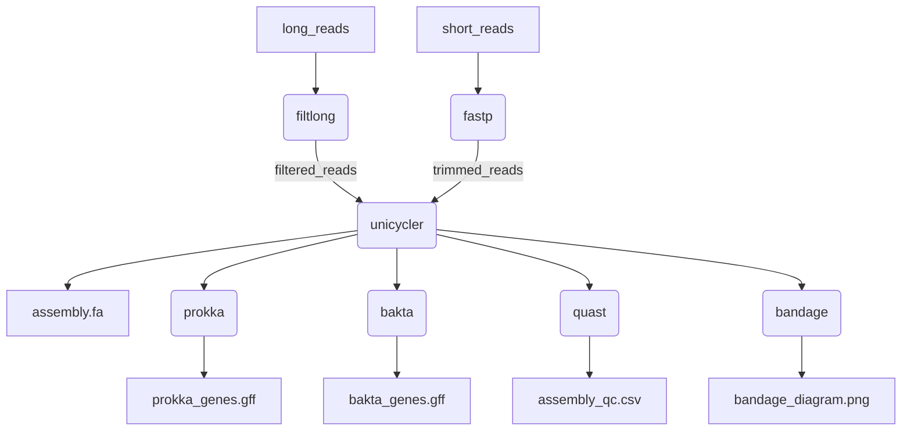

[](https://github.com/BCCDC-PHL/routine-assembly/actions/workflows/tests.yml)

# Routine Assembly
A generic pipeline for creating routine draft assemblies. Supports both short (illumina) and long (Oxford Nanopore) reads, or hybrid assemblies with both short and long reads.
Optionally annotate genes. Collects quality info on both incoming and outgoing datasets. 

## Analyses

* Read trimming & QC: [fastp](https://github.com/OpenGene/fastp) and [filtlong](https://github.com/rrwick/Filtlong)
* Genome Assembly: [unicycler](https://github.com/rrwick/Unicycler) (short reads, long reads, or hybrid)
* Gene Annotation: [prokka](https://github.com/tseemann/prokka) or [bakta](https://github.com/oschwengers/bakta)
* Assembly QC: [quast](https://github.com/ablab/quast), [bandage](https://github.com/rrwick/bandage)



## Usage

By default, unicycler will be used for assembly of short reads, and no gene annotation will be run:
```
nextflow run BCCDC-PHL/routine-assembly \
  --fastq_input <fastq input directory> \
  --outdir <output directory>
```

Prokka and/or bakta can be used with the `--prokka` and `--bakta` flags:
```
nextflow run BCCDC-PHL/routine-assembly \
  --fastq_input <fastq input directory> \
  --prokka \
  --bakta \
  --outdir <output directory>
```

Any combination of short/hybrid/long_only and prokka/bakta is supported:
Short reads with bakta:
```
nextflow run BCCDC-PHL/routine-assembly \
  --fastq_input <fastq input directory> \
  --bakta \
  --outdir <output directory>
```

...long reads with prokka:
```
nextflow run BCCDC-PHL/routine-assembly \
  --fastq_input_long <fastq input directory> \
  --long_only \
  --prokka \
  --outdir <output directory>
```

...hybrid with both:
```
nextflow run BCCDC-PHL/routine-assembly \
  --fastq_input <fastq input directory> \
  --fastq_input_long <fastq input directory> \
  --hybrid \
  --prokka \
  --bakta \
  --outdir <output directory>
```

The pipeline also supports a 'samplesheet input' mode. Pass a `samplesheet.csv` file with the headers `ID`, `R1`, `R2`:
```
nextflow run BCCDC-PHL/routine-assembly-nf \
  --samplesheet_input <samplesheet.csv> \
  --outdir <output directory>
```

Eg:
```
ID,R1,R2
sample-01,/path/to/sample-01_R1.fastq.gz,/path/to/sample-01_R2.fastq.gz
sample-02,/path/to/sample-02_R1.fastq.gz,/path/to/sample-02_R2.fastq.gz
sample-03,/path/to/sample-03_R1.fastq.gz,/path/to/sample-03_R2.fastq.gz
```

### Hybrid Assembly Mode
If long (Oxford Nanopore) and short (illumina) reads are both available, hybrid assemblies can be performed with `unicycler`. Note that `shovill` does not support hybrid assemblies.
Add the `--hybrid` flag to perform hybrid assembly, and supply long reads using the `--long_reads` flag. Sample IDs for both long and short reads are taken from all characters of the
fastq files up to the first underscore `_`. Sample IDs for short and long reads must match in order for the pipeline to match them up for hybrid assembly.

```
nextflow run BCCDC-PHL/routine-assembly \
  --fastq_input      <fastq input directory> \
  --fastq_input_long <long reads input directory> \
  --hybrid \
  --outdir <output directory>
```

Hybrid assembly mode is compatible with samplesheet input mode. When using a samplesheet for hybrid assemblies, an additional field with header `LONG` is required.
Note that in this mode, because the sample IDs are explicitly provided in the samplesheet, it isn't strictly necessary that the short and long read filenames have matching sample IDs
in their filenames (though it's still probably good practice to do so).

Eg:
```
ID,R1,R2,LONG
sample-01,/path/to/sample-01_R1.fastq.gz,/path/to/sample-01_R2.fastq.gz,/path/to/sample-01_L.fastq.gz
sample-02,/path/to/sample-02_R1.fastq.gz,/path/to/sample-02_R2.fastq.gz,/path/to/sample-02_L.fastq.gz
sample-03,/path/to/sample-03_R1.fastq.gz,/path/to/sample-03_R2.fastq.gz,/path/to/sample-03_L.fastq.gz
```

All samples in the samplesheet should have both short and long reads when running in hybrid assembly mode.

Run the pipeline as follows:

```
nextflow run BCCDC-PHL/routine-assembly \
  --samplesheet /path/to/samplesheet.csv \
  --hybrid \
  --outdir <output directory>
```

### Long-read-only Assembly Mode
If only long (Oxford Nanopore) reads are available, a long-read-only assembly mode is supported. Use the `--long_only` flag, as follows:

```
nextflow run BCCDC-PHL/routine-assembly \
  --fastq_input_long <long reads input directory> \
  --long_only \
  --outdir <output directory>
```

## Output
An output directory will be created for each sample under the directory provided with the `--outdir` flag. The directory will be named by sample ID, inferred from
the fastq files (all characters before the first underscore in the fastq filenames), or the `ID` field of the samplesheet, if one is used.

If we have `sample-01_R{1,2}.fastq.gz`, in our `--fastq_input` directory, the output directory will be:

```
sample-01
├── sample-01_20211125165316_provenance.yml
├── sample-01_fastp.csv
├── sample-01_fastp.json
├── sample-01_unicycler_short.fa
├── sample-01_unicycler_short.log
└── sample-01_unicycler_short_quast.csv
```

Including the tool name suffixes on output files allows re-analysis of the same sample with multiple tools without conflicting output filenames:

```
sample-01
├── sample-01_20211125165316_provenance.yml
├── sample-01_20211128122118_provenance.yml
├── sample-01_fastp.csv
├── sample-01_fastp.json
├── sample-01_unicycler_hybrid_bakta.gbk
├── sample-01_unicycler_hybrid_bakta.gff
├── sample-01_unicycler_hybrid_bakta.json
├── sample-01_unicycler_hybrid_bakta.log
├── sample-01_unicycler_hybrid_bandage.png
├── sample-01_unicycler_hybrid_prokka.gbk
├── sample-01_unicycler_hybrid_prokka.gff
├── sample-01_unicycler_hybrid_quast.csv
├── sample-01_unicycler_hybrid_quast.csv
├── sample-01_unicycler_hybrid.fa
├── sample-01_unicycler_hybrid.gfa
├── sample-01_unicycler_hybrid.log
├── sample-01_unicycler_short_bakta.gbk
├── sample-01_unicycler_short_bakta.gff
├── sample-01_unicycler_short_bakta.json
├── sample-01_unicycler_short_bakta.log
├── sample-01_unicycler_short_bandage.png
├── sample-01_unicycler_short_prokka.gbk
├── sample-01_unicycler_short_prokka.gff
├── sample-01_unicycler_short_quast.csv
├── sample-01_unicycler_short_quast.csv
├── sample-01_unicycler_short.fa
├── sample-01_unicycler_short.gfa
└── sample-01_unicycler_short.log
```

### Provenance files
For each pipeline invocation, each sample will produce a `provenance.yml` file with the following contents:

```yml
- pipeline_name: BCCDC-PHL/routine-assembly
  pipeline_version: 0.4.5
  nextflow_session_id: aad504aa-848f-4e85-8a9c-2aa43901d1b4
  nextflow_run_name: pedantic_carson
  timestamp_analysis_start: 2024-04-25T10:37:19.351714-07:00
- input_filename: sample-01_R1.fastq.gz
  sha256: 4ac3055ac5f03114a005aff033e7018ea98486cbebdae669880e3f0511ed21bb
  file_type: fastq-input
- input_filename: sample-01_R2.fastq.gz
  sha256: 8db388f56a51920752319c67b5308c7e99f2a566ca83311037a425f8d6bb1ecc
  file_type: fastq-input
- process_name: fastp
  tools:
    - tool_name: fastp
      tool_version: 0.23.1
- process_name: unicycler
  tools:
    - tool_name: unicycler
      tool_version: 0.4.8
- process_name: prokka
  tools:
    - tool_name: prokka
      tool_version: 1.14.5
      parameters:
        - parameter: --compliant
          value: null
- process_name: quast
  tools:
    - tool_name: quast
      tool_version: 5.0.2
      parameters:
        - parameter: --space-efficient
          value: null
        - parameter: --fast
          value: null
```

The filename of the provenance file includes a timestamp with format `YYYYMMDDHHMMSS` to ensure that re-analysis of the same sample will create a unique `provenance.yml` file.
